# Architecture — Warped (Android LLM Client)

> **Date**: 2026-04-30 &nbsp;|&nbsp; **Status**: Research &nbsp;|&nbsp; **Milestone**: M1

---

## 1. High-Level Architecture

The app follows **Clean Architecture** with four horizontal layers and vertical feature modules. Layers are strict: outer layers depend on inner layers; inner layers never know about outer layers.

```
┌─────────────────────────────────────────────────────────────┐
│  UI LAYER (Jetpack Compose + ViewModels)                    │
│  Screens, composables, ViewModels, navigation, themes       │
├─────────────────────────────────────────────────────────────┤
│  DOMAIN LAYER (Kotlin, no Android deps)                     │
│  Use cases, repository interfaces, domain models, contracts │
├──────────────┬──────────────────────────────────────────────┤
│  DATA LAYER  │  NATIVE LAYER (C/C++ via JNI / NDK)         │
│  Room,       │  llama.cpp inference engine                  │
│  DataStore,  │  GGUF loader, tokenizer                      │
│  Retrofit/   │  Metal/Vulkan GPU delegate                   │
│  OkHttp,     │  Thread management (CPU affinity)            │
│  Keystore    │                                              │
└──────────────┴──────────────────────────────────────────────┘
```

### 1.1 Layer Contracts

| Layer | Knows About | Provides | Never Knows About |
|-------|-------------|----------|-------------------|
| **UI** | Domain, Compose runtime | Screens, ViewModels, NavGraph | Data layer, Native layer |
| **Domain** | Kotlin stdlib only | UseCases, Repository interfaces, Domain models | Android APIs, Room, OkHttp, JNI |
| **Data** | Domain, Android SDK, 3rd-party libs | Repository implementations, Room DAOs, DTOs, API clients | UI, Compose |
| **Native** | llama.cpp, NDK, Domain (via callback interfaces) | InferenceSession, ModelLoader, Tokenizer | Android UI, Room, OkHttp |

### 1.2 Module Structure (Gradle)

```
app/
├── :core:common          # Domain models shared across all modules
├── :core:network         # OkHttp client, SSE parser, interceptor chain
├── :core:database        # Room DB, DAOs, entities, migrations
├── :core:security        # Keystore encryption, credential storage
├── :core:ui              # Shared Compose components, theme, design system
├── :feature:chat         # Chat screen, message list, streaming display
├── :feature:models       # Model management, download queue, import
├── :feature:endpoints    # Remote provider CRUD, testing, model listing
├── :feature:settings     # Generation params, presets, app settings
└── :library:llama-native # JNI bridge, .so packaging, inference service
```

---

## 2. Component Diagram

```mermaid
graph TD
    subgraph UI["UI Layer"]
        ChatScreen["Chat Screen\nCompose"]
        ModelsScreen["Models Screen\nCompose"]
        EndpointsScreen["Endpoints Screen\nCompose"]
        SettingsScreen["Settings Screen\nCompose"]
        ChatVM["ChatViewModel"]
        ModelsVM["ModelsViewModel"]
        EndpointsVM["EndpointsViewModel"]
        SettingsVM["SettingsViewModel"]
    end

    subgraph Domain["Domain Layer"]
        SendMessageUC["SendMessage\nUseCase"]
        StreamResponseUC["StreamResponse\nUseCase"]
        ManageEndpointsUC["ManageEndpoints\nUseCase"]
        ManageModelsUC["ManageModels\nUseCase"]
        DownloadModelUC["DownloadModel\nUseCase"]
        ImportModelUC["ImportModel\nUseCase"]
        SearchHFUC["SearchHuggingFace\nUseCase"]
        ManagePresetsUC["ManagePresets\nUseCase"]
    end

    subgraph Data["Data Layer"]
        ChatRepo["ChatRepository\n(impl)"]
        ModelRepo["ModelRepository\n(impl)"]
        EndpointRepo["EndpointRepository\n(impl)"]
        PresetRepo["PresetRepository\n(impl)"]
        HFAPIClient["HuggingFace\nAPI Client"]
        ProviderRouter["ProviderRouter\n(factory)"]
        OpenAIProvider["OpenAI\nProvider"]
        OllamaProvider["Ollama\nProvider"]
        LMStudioProvider["LM Studio\nProvider"]
        CustomProvider["Custom\nProvider"]
        DownloadManager["DownloadManager\n(WorkManager)"]
        RoomDB["Room\nDatabase"]
        DataStore["DataStore\nPreferences"]
        Keystore["Android\nKeystore"]
    end

    subgraph Native["Native Layer"]
        JNIBridge["JNI Bridge\n(Kotlin extern)"]
        LlamaCpp["llama.cpp\n(C/C++)"]
        GGUFLoader["GGUF Loader"]
        Tokenizer["Tokenizer"]
        GPUBackend["GPU Delegate\n(Metal/Vulkan/NNAPI)"]
    end

    UI -->|"depends on"| Domain
    Domain -->|"repository interfaces"| Data
    Data -->|"JNI calls"| Native
    ChatVM --> SendMessageUC
    ChatVM --> StreamResponseUC
    ChatVM --> ManagePresetsUC
    ModelsVM --> ManageModelsUC
    ModelsVM --> DownloadModelUC
    ModelsVM --> ImportModelUC
    ModelsVM --> SearchHFUC
    EndpointsVM --> ManageEndpointsUC
    ProviderRouter --> OpenAIProvider
    ProviderRouter --> OllamaProvider
    ProviderRouter --> LMStudioProvider
    ProviderRouter --> CustomProvider
    ProviderRouter --> JNIBridge
    DownloadManager --> HFAPIClient
    DownloadManager --> ManageModelsUC
```



---

## 3. Data Flow

### 3.1 Remote Chat — Streaming Response (primary path)

```
User types message
  → ChatScreen composable (UI event)
    → ChatViewModel.sendMessage(text)
      → SendMessageUseCase.execute(conversationId, text)
        → ChatRepository.sendMessage(...)
          → EndpointRepository.getActive()
          → ProviderRouter.resolve(endpoint) → OpenAIProvider
            → OkHttp POST /v1/chat/completions {"stream":true}
              → SSE event stream
                ↓ (token-by-token)
              ← onEvent(delta.content)
            → StreamResponseUseCase emits Flow<String> of tokens
          ← ChatRepository appends token to message, persists via Room
        ← UseCase returns Flow<StreamState> (token chunk OR error OR done)
      ← ViewModel collects Flow, updates StateFlow<ChatUiState>
    → ChatScreen recomposes with new token appended to message bubble
```

### 3.2 Local Chat — llama.cpp Inference

```
User types message (same UI path)
  → ProviderRouter.resolve(endpoint where endpoint.type = LOCAL)
    → LlamaInferenceProvider (implements LLMProvider interface)
      → JNIBridge.startInference(modelPath, contextSize, threads, ...)
        → Native thread: llama_eval() + llama_sample() loop
          → JNI callback per token generated
        ← LlamaInferenceProvider emits tokens via same Flow<StreamState>
  → Rest of pipeline identical to remote — UI doesn't know the difference
```

### 3.3 Model Download Flow

```
User taps "Download" on Hugging Face search result
  → ModelsViewModel.downloadModel(modelId, repoId, filename)
    → DownloadModelUseCase.execute(model)
      → DownloadManager.enqueue(modelUrl, destination)
        → WorkManager: unique periodic work
          → HFAPIClient.downloadFile(url) → OkHttp streaming GET
            → File I/O: write chunks to app internal storage
            → DataStore: persist progress %
          ← on completion → ModelRepository.insert(model metadata)
    ← ViewModel observes WorkInfo via Flow → updates UI progress bar
```

### 3.4 Endpoint Testing Flow

```
User taps "Test" on endpoint config form
  → EndpointsViewModel.testEndpoint(endpoint)
    → ManageEndpointsUseCase.testConnection(endpoint)
      → ProviderRouter.resolve(endpoint).test()
        → OkHttp HEAD or GET /v1/models
          → timeout 5s → success: model count | failure: error message
    ← ViewModel updates test result state
```

### 3.5 Key Contract: Provider Interface

All chat providers (local + every remote type) implement the same interface. This is the central abstraction that decouples UI data flow from provider specifics:

```kotlin
// domain layer — no Android deps
interface LLMProvider {
    val type: ProviderType
    suspend fun chat(
        messages: List<Message>,
        params: GenerationParams,
    ): Flow<StreamToken>

    suspend fun listModels(): Result<List<ModelInfo>>

    suspend fun testConnection(): Result<ConnectionStatus>
}

sealed interface StreamToken {
    data class Delta(val content: String) : StreamToken
    data object Done : StreamToken
    data class Error(val message: String) : StreamToken
}
```

Five implementations:
- `OpenAIProvider` — standard `/v1/chat/completions` with SSE streaming
- `OllamaProvider` — `/api/chat` with Ollama-specific fields
- `LMStudioProvider` — OpenAI-compatible (same protocol, localhost default)
- `CustomProvider` — user-configured base URL, handles auth variants
- `LlamaInferenceProvider` — JNI bridge, uses same interface but talks to llama.cpp

---

## 4. Module Boundaries & Dependencies

### 4.1 Dependency Graph (Gradle)

```
:feature:chat ────────────────┐
:feature:models ──────────────┤
:feature:endpoints ───────────┼──→ :core:common
:feature:settings ────────────┘     (domain models, interfaces)

:core:network ←── :core:security (keystore interceptor)
:core:database ←── :core:common
:core:security ←── :core:common

:feature:* ──→ :core:ui (shared composables, theme)
:feature:* ──→ :core:network (via domain repositories)
:feature:* ──→ :core:database (via domain repositories)

:library:llama-native ──→ :core:common (domain interfaces only)
                          (never depends on :core:network, :core:database, or :feature:*)
```

### 4.2 Boundary Rules

| Rule | Rationale |
|------|-----------|
| `:core:common` has zero Android dependencies | Pure Kotlin; testable on JVM without emulator |
| `:library:llama-native` only exposes domain interfaces | Swap inference engine (ExecuTorch, MLC) without changing app code |
| `:feature:*` modules never depend on each other | Avoid coupling; features compose via navigation only |
| `:core:network` owns OkHttp, not individual features | Single interceptor chain for timeout/retry/auth/logging |
| Repository implementations are in `:core:database` + `:core:network` | Data layer lives in core modules; features only consume interfaces |

### 4.3 What Each Module Owns

| Module | Owns |
|--------|------|
| `:core:common` | `Message`, `Conversation`, `ModelMetadata`, `EndpointConfig`, `GenerationParams`, `GenerationPreset`, `LLMProvider` (interface), `StreamToken`, `ProviderType` enum, `DownloadState` |
| `:core:network` | `ApiClient`, `SSEParser`, `AuthInterceptor`, `RetryPolicy`, `ConnectivityMonitor` |
| `:core:database` | Room `@Entity` classes, `@Dao` interfaces, `AppDatabase`, `Migration` objects, `TypeConverters` |
| `:core:security` | `KeystoreManager`, `EncryptionUtil`, `ApiKeyStore` |
| `:core:ui` | `WarpedTheme`, `MessageBubble`, `ModelCard`, `DownloadProgressBar`, `EndpointForm`, `LoadingIndicator`, shared composables |
| `:feature:chat` | `ChatScreen`, `ChatViewModel`, `ConversationList` composable |
| `:feature:models` | `ModelsScreen`, `ModelDetailScreen`, `DownloadScreen`, `HuggingFaceSearchSheet` |
| `:feature:endpoints` | `EndpointsScreen`, `EndpointFormScreen`, `TestResultDialog` |
| `:feature:settings` | `SettingsScreen`, `PresetEditor`, `AboutScreen` |
| `:library:llama-native` | `LlamaBridge.kt` (JNI externs), `CMakeLists.txt`, compiled `.so`, `InferenceConfig`, GPU delegate setup |

---

## 5. Suggested Build Order

Phases are ordered by dependency chain. Each phase produces a **runnable increment**.

### Phase 1: Skeleton + Data Foundation

```
:core:common   (all domain models & interfaces)
:core:security (keystore)
:core:database (Room setup, migrations, DAOs, repositories)
:core:ui       (theme, empty-shell composables)
```

**Why first**: Everything depends on domain models. Room schemas must exist before any feature can persist data. Security primitives are needed before API key storage. Composables shared through `:core:ui` should stabilize early.

**Deliverable**: App compiles with navigation skeleton, Room DB created, Keystore encryption functional. No features yet — just foundations in place.

### Phase 2: Remote Providers

```
:core:network   (OkHttp, SSE parser, interceptor chain)
:feature:endpoints (CRUD + test remote endpoints)
:feature:chat     (chat UI, streaming display, message persistence)
```

**Why second**: Remote chat is the quickest path to a working chat loop (no native compilation). It validates the `LLMProvider` interface, streaming data pipeline, and Room persistence integration. All subsequent providers reuse the same interface.

**Deliverable**: Full chat cycle with remote OpenAI-compatible + Ollama + LM Studio + Custom endpoints. Messages persist, conversations resume. Streaming works.

### Phase 3: Model Management + Downloads

```
:feature:models (Hugging Face search, download with pause/resume, import)
```

**Why third**: Requires `:core:network` (HTTP downloads, HF API) and `:core:database` (model metadata). Builds on the DownloadManager + WorkManager infrastructure. No inference yet — just get GGUF files onto the device.

**Deliverable**: Search HF, download GGUF models, pause/resume, import from storage, view/delete downloaded models.

### Phase 4: Local Inference

```
:library:llama-native (JNI, llama.cpp, GGUF loader, GPU delegates)
```

**Why last**: Native compilation is the most complex, platform-specific step. It depends on Phase 3 (models must exist on device first). By this point, the `LLMProvider` interface and chat pipeline are fully validated with remote providers — adding a local provider is just another implementation.

**Deliverable**: Load GGUF, infer with streaming, configurable threads/context/gpu. Offline chat works end-to-end.

### Phase 5: Settings, Presets, Polish

```
:feature:settings (generation params, presets, app config)
```

**Why last**: Settings and presets are configuration on top of working functionality. All user-facing parameters (temperature, context, threads) must already be wired through the pipeline. This phase adds the UI to tweak them and the preset persistence.

**Deliverable**: Save/load presets, adjust all generation params, app settings screen complete.

---

## 6. Cross-Cutting Concerns

### 6.1 Error Handling Strategy

```
Layer          Strategy
─────────────────────────────────────────────────
UI             Catch errors in ViewModel, map to sealed UiState.Error,
               display via Snackbar / inline error composable.
               Never let exceptions bubble to Compose rendering.

Domain         Use Result<T> or custom Outcome sealed class.
               Never throw from UseCases; map exceptions to error types.

Data           Wrap API calls in try/catch, return Result<T>.
               SSE parser errors mapped to StreamToken.Error.

Native         JNI exceptions caught in LlamaBridge, converted to
               domain-visible error tokens via callback.
```

Error channel in streaming:
```
Native crash → JNI env->ExceptionCheck() → StreamToken.Error("inference halted at token 342")
OkHttp timeout → SSE stream closes → StreamToken.Error("connection lost, retry?")
Bad auth → 401 response → Result.failure(AuthError) → ViewModel → show re-auth dialog
```

### 6.2 Logging

- **Debug builds**: Timber, tag per module (`Warped/ChatVM`, `Warped/LLM`, `Warped/OkHttp`)
- **Release builds**: Crash reports only (Firebase Crashlytics or self-hosted Sentry)
- **Redaction**: Never log raw API keys, tokens, or message content. Redact before emitting.
- **Native logs**: `__android_log_print` bridged to Timber via JNI callback.

### 6.3 Analytics (optional, gated)

- Privacy-first: opt-in only, local-first by default
- Track: feature usage (remote vs local %), model download completion rate, crash rate
- Never track: message content, model names, endpoint URLs, API keys

### 6.4 Connectivity

- `ConnectivityMonitor` in `:core:network` observes `NetworkCallback`
- Exposes `StateFlow<ConnectivityState>` — offline / online / metered
- Remote providers: disable UI buttons when offline, show banner
- Local inference: no connectivity check needed
- Downloads: auto-pause on metered, resume on unmetered (user-configurable)

### 6.5 Performance Constraints

| Constraint | Enforcement |
|------------|-------------|
| UI thread never blocked | All I/O (network, DB, file) on Dispatchers.IO; inference on native thread |
| Memory: <200MB per inference session | Monitor via `Runtime.getRuntime()`, warn user on low-memory devices |
| Battery: no wakelocks during idle | WorkManager for downloads, cancel inference when app backgrounded |
| Storage: GGUF models can be 1-8GB | Check available space before download, surface clear warning |

---

## 7. Testing Strategy

### 7.1 Test Layers

```
═══════════════════════════════════════════════════════════
  UI TESTS (Compose Testing)
  Verify screens render, ViewModels emit correct UiState,
  navigation flows work. Mock domain layer entirely.
  Tool: Compose Test + Turbine (for Flow testing)
═══════════════════════════════════════════════════════════
  DOMAIN TESTS (JVM, no emulator)
  Verify UseCase logic, repository interface contracts.
  Pure Kotlin, runnable on CI without Android. Fastest tier.
  Tool: JUnit 5 + MockK + kotlinx-coroutines-test
═══════════════════════════════════════════════════════════
  DATA INTEGRATION TESTS (Instrumented or Robolectric)
  Verify Room DAOs, migration paths, API client serialization.
  Verify SSE parser with fixture byte streams.
  Tool: Room testing, OkHttp MockWebServer
═══════════════════════════════════════════════════════════
  NATIVE TESTS (C++ unit + E2E)
  Verify JNI bridge, GGUF loading, tokenizer correctness.
  Verify inference produces sane output for known tiny model.
  Tool: GoogleTest, shell script on CI with ARM emulator
═══════════════════════════════════════════════════════════
```

### 7.2 Key Test Scenarios

| Scenario | Layer | Priority |
|----------|-------|----------|
| Streaming token display — tokens appear incrementally in UI | UI | P0 |
| SSE parser handles split chunks across TCP frames | Data | P0 |
| Room migration from version N to N+1 | Data | P0 |
| API key encryption/decryption round-trip | Data | P0 |
| ProviderRouter returns correct provider for each `ProviderType` | Domain | P1 |
| DownloadManager pause/resume produces valid file | Instrumented | P1 |
| llama.cpp inference produces consistent output for fixed seed | Native | P1 |
| App survives config change during streaming | UI | P2 |
| Connectivity loss mid-stream — graceful error | Integration | P2 |

### 7.3 CI Pipeline (ideal per-commit)

```
1. ktlint / detekt (5s)
2. Domain tests on JVM (30s)
3. Data tests on Robolectric (2m)
4. UI screenshot diff tests (3m)
5. Native build + C++ tests on emulator (5m, optional on PR only)
```

---

## Appendix A: Technology Mapping

| Concern | Library | Rationale |
|---------|---------|-----------|
| DI | Hilt | Standard Android DI, Compose-aware ViewModel injection |
| Navigation | Compose Navigation | Official, type-safe with serializable routes |
| HTTP | OkHttp 4 | SSE streaming, interceptor chain, HTTP/2 |
| DB | Room | Official, Compose Flow integration, migration testing |
| Prefs | DataStore | Coroutine-based, replaces SharedPreferences |
| Downloads | WorkManager | Survives app death, constraints, progress |
| JSON | kotlinx.serialization | Kotlin-native, no reflection, Compose nav support |
| Image loading | Coil | Compose-native async image loading (model images) |
| Markdown | compose-markdown | Render model responses with basic markdown |
| Logging | Timber | Tiny, tag-per-class, debug/release aware |
| Testing | Turbine + MockK + Compose Test | Flow testing, mocking, UI assertions |

## Appendix B: Open Questions

1. **GPU delegate selection**: Vulkan vs. NNAPI vs. CPU-only? Which gives best perf on Snapdragon 8 Gen 2/3 (current flagship)? Needs benchmarking spike.
2. **Quantization floor**: Q4_K_M is the practical minimum for 7B models on 8GB phones. Should the app enforce a minimum, or warn + allow anyway?
3. **Model cache eviction**: Should the app auto-delete unused models when storage is low (like iOS does with apps), or leave it to the user?
4. **Android 15+ 16KB page size**: llama.cpp must build with `-DLLAMA_NO_ALIGNMENT` for 16KB page devices. Confirm JNI build flags.
